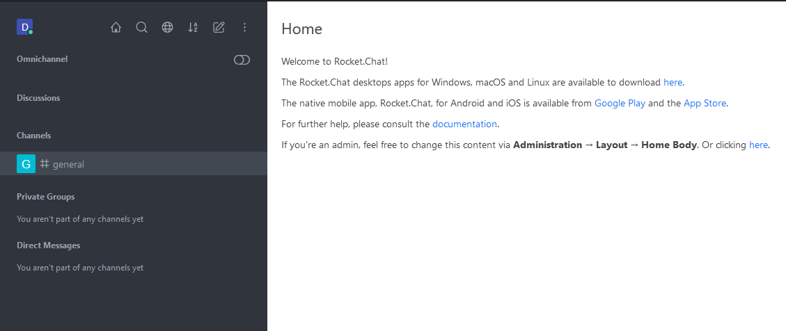

## Resources

Omni-chat merupakan sistem aplikasi pelayanan dalam bentuk live-chat maupun call center. Omni-chat membutuhkan 2 jenis server dalam pengembangannya, dengan spesifikasi berikut:

- Dual-Core 2GB chat server
- Dual-Core 2GB call server

## User Roles
Omni-chat memiliki beberapa jenis default user role yang nantinya bisa ditambahkan jumlahnya. Masing-masing role memiliki cakupannya sendiri.
Jenis-jenis rolenya yaitu:

- livechat-agent: Agent dari livechat itu sendiri. Bertugas untuk menjawab permintaan yang diberikan di dalam livechat.
- live-chat-manager: Manager dari livechat, bertugas mengatur agent maupun visitor yang masuk.
- livechat-visitor: Pengguna yang datang melalui channel livechat.

## Instructions
Sebelum masuk ke dalam omni-chat server, pengguna baik agent, manager maupun visitor perlu membuka url `https://chat.modena.dev.gsk.tsun.moe/home` kemudian memasukkan email / username beserta passwordnya pada menu login tersebut.

Setelah pengguna masuk ke dalam server omni-chat, tampilan dashboard akan muncul. Tampilan disini akan berbeda berdasarkan dari role user pada saat pengisian data pada menu login.

Apabila pengguna mengisi data dengan user-role manager, maka tampilan awal yang muncul adalah home dari server itu sendiri. Selain itu live-chat manager juga mengatur bagian dari administrasi user yang terdapat pada chat server tersebut.

Apabila pengguna mengisi data sebagai user-role agent, maka tampilan awal yg muncul adalah home dari agent itu beserta list agent yang tersedia pada server tersebut. Selain itu, saat terdengar suara pada saat agent masuk ke dalam server.

Untuk bagian visitor, tampilan livechatnya seperti pada fitur chat call center, embedded pada web yang nantinya akan direspon oleh agent.

